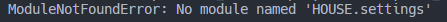
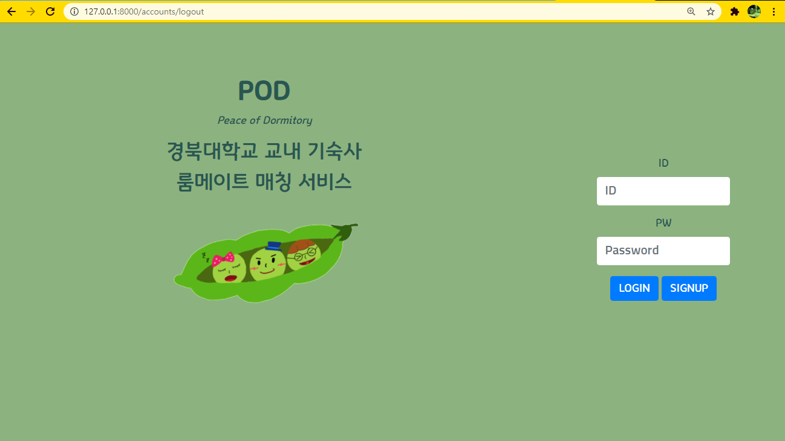
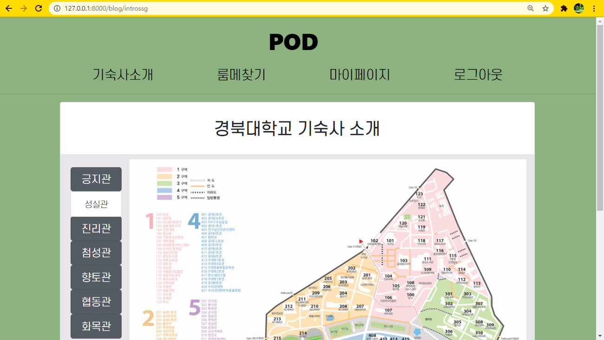
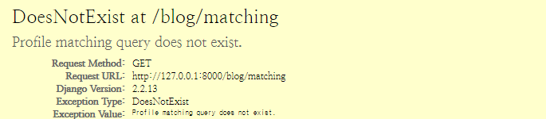
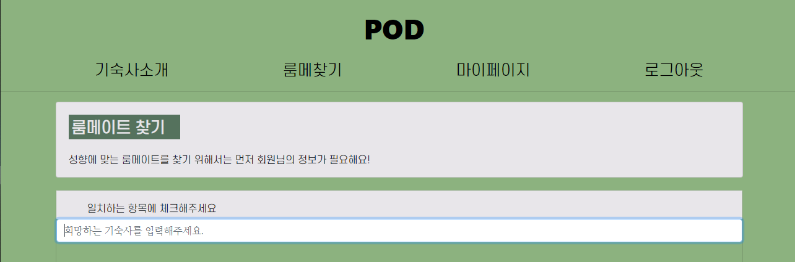

### Error 01

프로젝트 내에서 `settings.py` 파일을 찾을 수 없음 ➡ 파일 구조 확인 결과 settings.py 파일이 프로젝트 폴더 외부에 있었으므로 폴더 이름 변경 및 파일 이동 후 성공

### Error 02

**BE** 로그아웃 후 이동되는 페이지 url이 메인 페이지`path('', blog**.**views**.**home, name='home')`이 아니라 logout url로 따로 이동되는 것 수정 필요.

### Error 03

**FE** 기숙사 소개 페이지 한 화면에 출력될 수 있도록 수정하기(스크롤바 사용 ❌)

### Error 04

매칭용 설문조사 제출 후에 뜨는 화면.

매칭하는 게 일인 웹인데 매칭을 못하면 아 어쩌란 말이냐

>  `matching query does not exist`는 주로 `object.get`가 정보를 찾지 못했을 때 발생한다

### Error 05

회원가입/로그인은 가능한데 회원탈퇴 기능이 없다. 추가해야겠음

### Error 06

그리고 여기서 아래 기숙사 입력에 선택 버튼을 추가해야겠다. 드롭다운 or 라디오버튼이라거나