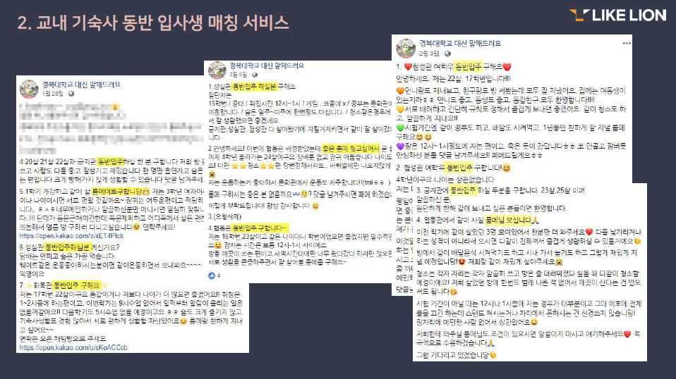

## 경북대학교 교내 기숙사 룸메이트 매칭 서비스

### Date :2019 . 05. 24~ 2019. 05. 25 

> **소개** 
>
> 경북대학교 교내 기숙사 지원 시 최대한 생활 패턴이 일치하는 지원자들끼리  룸메이트로 매치하여 편리한 생활을 할 수 있도록 도움을 주기 위함. 

**Contributors** : ⬛근영, ⬛승인, ⬛예린, ⬛구문

- FE : ⬛근영, ⬛예린, ⬛구문
- BE : ⬛승인, ⬛예린

Django 상에서 Html, CSS를 활용해서 프론트엔드 작업을 했다.

JavaScript에 대한 지식이 없어서 못 써 본 점이 무척 아쉽다! 프론트의 꽃은 JS라던데😶

**후기**

동아리하면서 진행한 첫 프로젝트이자 <u>내가 처음으로 개발해 본</u> 웹 서비스.

운이 좋게도 내가 기획한 아이디어가 많은 사람들에게 긍정적이었고, 그렇게 해서 팀원을 구할 수 있었다(감사합니다 친구들‼)

타지에서 학교를 다니는 사람들에게 기숙사는 차후 1년의 생활을 결정할 만큼 중요한 문제다. 의식주 중 하나인 주거 문제가 걸려 있기도 하고. 아래에 내가 아이디어 피칭할 때 만들었던 PPT 일부를 갖고 왔다.

그렇기 때문에 우리 팀원들 모두 기숙사생이거나 기숙사 거주 경험이 있었다는 점에서 공감을 얻기 좋았던 것 같다. 사실 공통된 공감대 형성을 할 수 있었던 것이 팀원을 모집하는데 큰 역할을 하지 않았을까 혼자 생각한다.

시험기간임에도 다들 프로젝트 작업하느라 고생했고, 시험 끝나고 우리 학교 축제 기간이었는데(심지어 싸이가 왔다 ㄷㄷ) 제대로 놀지도 못하고 바로 해커톤 하러 온다고 다들 고생이 많았다ㅠㅠ 그래도 goorm 써서 서버로 제출 잘 한 조가 우리밖에 없었던 것은 뿌듯하다! 그리고 결과적으로 2등도 했고! 

우리 팀원들이랑 멘토로 고생해 준 7기 운영진들에게 무한한 감사✨✨

**프로젝트 구성**
